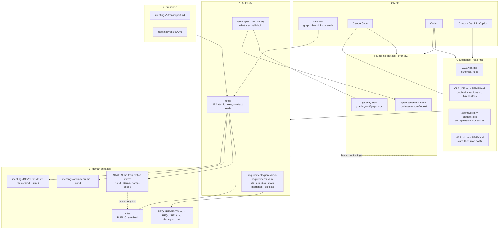
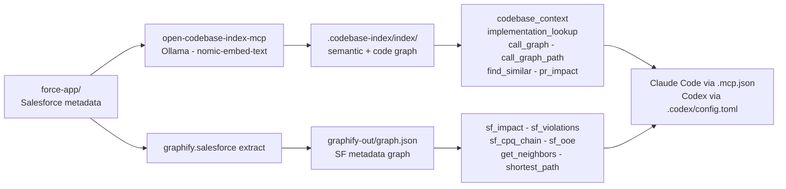
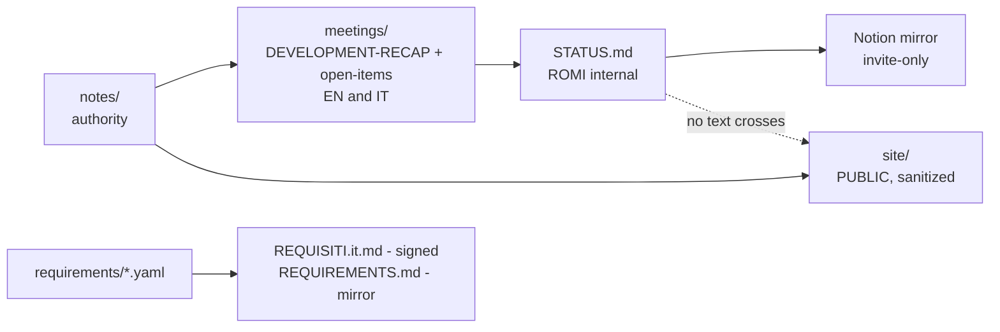

# Architecture

How this repository is put together: an Obsidian knowledge vault, two generated
machine indexes reached over MCP, a Salesforce DX build, and a set of rendered
publication surfaces — all in one Git repository, read by five different agent
runtimes and by humans.

This file is the **schema**. Operating detail lives elsewhere and is not repeated
here: [code-intelligence.md](code-intelligence.md) for index setup and refresh
commands, [publishing.md](publishing.md) for what may leave the repository,
[Retrieval and write protocol](../notes/Retrieval%20and%20write%20protocol.md)
for how to read and write knowledge, and [AGENTS.md](../AGENTS.md) for the rules
themselves.

## The one idea

**Every file here is exactly one of four kinds.** Almost every way this project
can go wrong is someone treating a file as the wrong kind — editing a rendered
view, quoting a generated graph as a finding, or typing a fact into Notion.

| Kind                       | Rule                                | Examples                                                                            |
| -------------------------- | ----------------------------------- | ----------------------------------------------------------------------------------- |
| ① **Authority**            | Edit here. Everything else follows. | `requirements/*.yaml`, `notes/`, `force-app/` + the org                             |
| ② **Preserved record**     | Never edit, ever.                   | `meetings/*-transcript.it.md`, `meetings/results/*.md`                              |
| ③ **Derived for humans**   | Regenerate from ①. Never author.    | `meetings/DEVELOPMENT-RECAP*`, `meetings/open-items*`, `STATUS.md`, Notion, `site/` |
| ④ **Derived for machines** | Rebuild. Never a source of truth.   | `.codebase-index/index/`, `graphify-out/graph.json`                                 |

## The schema

The two dotted edges are the rules that are easiest to breach by accident:
**text never moves from the internal surface to the public one**, and a machine
index is **evidence to check, never a finding to report**.

---

## Plane 1 — the knowledge vault (Obsidian)

`notes/` is an Obsidian vault that is also plain, portable Markdown. It is the
volatile layer: open items, decisions, risks, people, and what is actually built.
The design goal is that **the same files work in Obsidian, VS Code, GitHub and
every agent CLI** with no plugin and no conversion step.

### Layout

| Folder                                    | Holds                                   | Count\* |
| ----------------------------------------- | --------------------------------------- | ------- |
| [notes/items/](../notes/items/)           | `OI-NN` open items                      | 54      |
| [notes/people/](../notes/people/)         | Person notes, both orgs                 | 16      |
| [notes/risks/](../notes/risks/)           | Named delivery risks                    | 10      |
| [notes/objects/](../notes/objects/)       | What is built, per object               | 7       |
| [notes/traces/](../notes/traces/)         | Sweep watermarks                        | 6       |
| [notes/meetings/](../notes/meetings/)     | Per-session fact notes                  | 4       |
| [notes/flows/](../notes/flows/)           | Designed process flows                  | 3       |
| [notes/sessions/](../notes/sessions/)     | Archived journal quarters               | 1       |
| [notes/decisions/](../notes/decisions/)   | Standalone decisions                    | 0       |
| [notes/dashboards/](../notes/dashboards/) | **Human-only** — may use Dataview/Bases | 0       |
| `notes/*.md` (root)                       | Cross-cutting reference notes           | 11      |

\* as of 2026-08-25; `npm run vault:check` prints the live total.

### The four format rules, and why

- **The filename is the note's H1.** Obsidian's graph labels a node with its
  filename and nothing else, so `OI-64 The bundle Apex test suite is broken.md`
  is readable in the graph without opening it. A slug would not be.
- **Relative Markdown links, `%20`-encoded** — never `[[wikilinks]]`. Wikilinks
  resolve only inside Obsidian; GitHub prints them literally and agents cannot
  follow them. `app.json` enforces the Obsidian side (`useMarkdownLinks: true`,
  `newLinkFormat: relative`, `alwaysUpdateLinks: true`).
- **Plain YAML frontmatter** — `id`, `type`, `status`, `updated` required.
  Parseable by anything, no plugin needed. Full schema in
  [AGENTS.md](../AGENTS.md).
- **ASCII filenames with spaces.** Spaces keep the graph readable; ASCII keeps
  Windows paths and Markdown link targets working. Accents are transliterated.
- **No Dataview/Bases blocks outside `notes/dashboards/`.** An agent reads the
  query source, not the rendered table.

**`OI-NN` ids are the tracker's own row numbers**, permanently. They are cited in
`REQUIREMENTS.md`, in the published artifacts and in client correspondence, so
they are never renumbered and never reused.

### The committed vault config

`.obsidian/` is **committed on purpose**, so every machine reads the same graph;
only per-machine UI state (`workspace.json`, `cache`) is gitignored.

- `app.json` — Markdown-link mode, plus `userIgnoreFilters` that hide
  `force-app/`, `node_modules/`, `.sf/`, `.sfdx/`, `.husky/`, `site/`, `config/`,
  `manifest/`, `scripts/` and `requirements/` from the vault. The vault is the
  knowledge layer; the build is not noise inside it.
- `graph.json` — fifteen colour groups, so the graph is legible at a glance:
  items, risks, people, objects, flows, decisions, meetings and traces each get a
  colour, as do `meetings/results/`, the transcripts, the proposals, the two
  trackers, the two requirement texts, and the routing documents
  (`MAP` / `INDEX` / `JOURNAL` / `AGENTS` / `docs/`).
- `core-plugins.json` — graph, backlinks, outgoing links, properties, tag pane
  and search on; daily notes, slides and Sync off.

### The enforcement

`npm run vault:check` ([scripts/vault-check.mjs](../scripts/vault-check.mjs)) is
dependency-free Node and encodes all of the above: required frontmatter, unique
ids, `OI-NN` shape, filename-equals-H1, ASCII filenames, resolvable relative
links, no wikilinks, no Dataview outside `dashboards/`. It also traces notes
against the requirement register **in both directions** — a note's `requirement:`
and a requirement's `tracked_by:` must agree — and reports mismatches as
warnings, because the backlog predates the check.

It validates links out of `notes/`, the root documents, `copilot-instructions.md`
and **every `SKILL.md`**, so renaming a note cannot silently break a procedure
that reads it. The nightly routine commits only when this script exits 0.

---

## Plane 2 — the machine indexes (MCP)

Two generated, local, gitignored views of the build, exposed to Codex and Claude
Code as MCP servers. They accelerate discovery; they hold no authority.

### What each one answers

| Ask                                                                                                           | Route                                |
| ------------------------------------------------------------------------------------------------------------- | ------------------------------------ |
| Where is this implemented? Who calls it? What is similar? What does this branch touch?                        | **open-codebase-index**              |
| Which objects, fields, permissions, Flows? What breaks if I change this? Order of execution? Governor Limits? | **graphify-sfdx**                    |
| Exact or exhaustive text                                                                                      | **`rg`** — neither index             |
| A requirement, a decision, an owner, an open item                                                             | **`MAP.md` → `INDEX.md` → `notes/`** |

### Wiring

Both clients launch the **same two backends over the same generated data**:

- Claude Code reads [.mcp.json](../.mcp.json) and asks once for project-server
  approval.
- Codex reads [.codex/config.toml](../.codex/config.toml), which additionally
  pins `startup_timeout_sec`, `tool_timeout_sec`, `required = false` and an
  explicit `enabled_tools` allowlist.

`open-codebase-index` indexes **code and machine-readable metadata only** —
`.cls`, `.trigger`, `.js`, `.xml`, `.yaml`, `.soql` and friends, per
[.codebase-index/config.json](../.codebase-index/config.json). The meeting
archive and the atomic notes are deliberately **out of scope**: code search stays
separate from the human knowledge protocol, and preserved transcripts are never
embedded. Graphify reads `force-app/` as Salesforce metadata and excludes `.sf/`
and `.sfdx/` so generated standard libraries cannot pollute impact results.

### Freshness — two different models

`open-codebase-index` watches files and updates incrementally. Graphify is a
**snapshot** and has to be re-extracted, so every path that can invalidate it
rebuilds it unconditionally:

| Trigger                          | Mechanism                                      |
| -------------------------------- | ---------------------------------------------- |
| Session start                    | `scripts/graphify_serve_fresh.py`              |
| Editing `force-app/` mid-session | the same wrapper's 2 s watcher                 |
| `sf project retrieve start`      | the same watcher, or the `postretrieve` script |
| `git checkout` / branch switch   | `.husky/post-checkout`                         |
| `git merge` / `git pull`         | `.husky/post-merge`                            |
| `git rebase` / amend             | `.husky/post-rewrite`                          |

All three hooks call
[scripts/refresh-sf-graph.sh](../scripts/refresh-sf-graph.sh). The extract is
deterministic — byte-identical output on unchanged input, about a quarter-second
— which is why nothing tries to detect staleness. `graphify.serve` stats
`graph.json` on every tool call and reloads on an mtime/size change, so a rebuild
reaches a **running** session with no restart.

The whole path **degrades instead of breaking**: a failed rebuild logs to stderr
and serves the previous graph, and a machine without the Python toolchain makes
the hooks no-op silently, so no Git operation ever fails because of them.
`npm run intelligence:verify` proves the mechanism end to end in about 20 s.

Two constraints bind anyone editing the wrapper: **stdout is the JSON-RPC
channel** (a stray `print()` corrupts the protocol), and **child processes must
not inherit fd 0** — measured at a 20 s timeout inherited against 0.25 s with
`stdin=DEVNULL`.

### Seeing them

Both indexes answer in text — that is what they are for. The one visual is
`npm run intelligence:view`, which renders the Salesforce graph into
`graphify-out/graph.html`: a filterable force-directed map of objects, fields,
Apex, LWC, rules and order-of-execution steps, with the `file:line` behind every
edge. Generated, gitignored, and stripped of the Apex source the graph carries.
Detail: [code-intelligence.md](code-intelligence.md).

The knowledge vault has its own, older answer to the same question — Obsidian's
graph view, coloured by the committed groups in `.obsidian/graph.json`. The two
never meet: one draws the metadata, the other draws the record.

### The standing caveat

Graphify confidence labels and violation results are **leads**. Inspect the cited
metadata before reporting or changing anything — a simple loop heuristic will
flag an Apex SOQL-for loop even when no query executes per record. Neither index
ever overrides the requirement register, the notes, a preserved record, or a
current org inspection.

---

## Plane 3 — the Salesforce build

Ordinary Salesforce DX: metadata in
[force-app/main/default/](../force-app/main/default/), scratch-org definitions in
[config/](../config/), manifest in [sfdx-project.json](../sfdx-project.json), and
retrieve wrapped as `npm run retrieve` so the graph refreshes behind it.

**`force-app/` and the org disagree, and the trackers disagree with both.** That
is a live project condition, not a defect in the setup — see [MAP.md](../MAP.md)
and
[The build ahead of the record](../notes/objects/The%20build%20ahead%20of%20the%20record.md).
Any claim about what is built must say **which of the three was checked, and
when**.

Quality gates run on commit through Husky and lint-staged: Prettier (with the
Apex and XML plugins) on everything, ESLint on `aura`/`lwc`, and `sfdx-lwc-jest`
`--findRelatedTests` on touched LWCs. `npm run vault:check` is the
knowledge-side equivalent, run before committing knowledge changes.

---

## Plane 4 — the publication surfaces

Everything below `notes/` is **regenerated, never authored**. Three consequences
that bite:

- **Notion is a publish target, never a source.** A fact typed into Notion is
  lost at the next regeneration. The mirror is refreshed by step 6 of
  [org-status-check](../.agents/skills/org-status-check/SKILL.md); a missing
  connector is not a failure — the file is the deliverable and the mirror simply
  goes stale until a session with the connector catches it up.
- **`STATUS.md` is ROMI-internal and names people; [site/](../site/) is public.**
  No sentence moves from the first to the second. `site/` is a public folder
  inside a private repository — hosting would be Cloudflare Pages by direct
  upload, and **nothing is deployed yet**.
- **No catalogue prices, no article-code values, no credentials on any surface,
  internal included.** Describe a field, never a value. Every price currently in
  UAT is a ROMI placeholder, which makes publishing one worse than publishing a
  real number.

Language is not a translation layer here: **`REQUISITI.it.md` is the text
presented for signature**, `REQUIREMENTS.md` mirrors it. Facts and reasoning are
read in English; agreed client wording is governed by the Italian; a requirement
change lands in **both, in the same session**.

There is a fourth channel — **artifacts on claude.ai**, listed in
[README.md](../README.md) — private unless shared, and several have been shared
with the client. The publication rules above apply to anything shared onward.

---

## The agent layer

`AGENTS.md` is canonical and tool-neutral. `CLAUDE.md`, `GEMINI.md` and
`.github/copilot-instructions.md` are thin pointers to it — **edit the canonical
file, not the pointers.**

Six procedures live as plain Markdown in `.agents/skills/`, mirrored into
`.claude/skills/`. Claude Code loads them as skills automatically; every other
tool reads the file, and "follow `.agents/skills/drill-me/SKILL.md`" is a
complete instruction.

| Skill                | For                                                                  |
| -------------------- | -------------------------------------------------------------------- |
| `drill-meeting`      | A new transcript arrived — full pipeline through to both recaps      |
| `drill-me`           | Decide what to unblock next, interactively                           |
| `org-status-check`   | Compare the org against the record; regenerates `STATUS.md`          |
| `requirements-check` | Sweep mail, Slack, Drive and Fathom for new input                    |
| `requirement-trace`  | Make a requirement auditable back to its meeting                     |
| `start-sf-projects`  | ⚠ **A generator for _other_ projects, not a procedure for this one** |

`start-sf-projects` produced the other five from its
`assets/project-skills/*/SKILL.md.tpl` templates. **Editing a skill here does not
change what the next project gets** — that has to be done in the template, which
also has a drifting copy in the `life365` repository.

A **cloud routine** runs `requirements-check` Monday–Friday at 23:30
Europe/Budapest on `DevMain`, committing directly, watermarked by the newest file
in [notes/traces/](../notes/traces/), and reporting to one Slack group DM. It
commits only if `vault:check` passes. Full configuration and the October DST
caveat: [README.md](../README.md) and [task-status.md](task-status.md).

---

## What happens when…

| Event                          | The system's response                                                                                                                            |
| ------------------------------ | ------------------------------------------------------------------------------------------------------------------------------------------------ |
| A transcript arrives           | `drill-meeting`: preserve the Italian original → atomic notes → regenerate both recaps and both trackers → `JOURNAL.md` → `vault:check`          |
| You edit `force-app/`          | The codebase index updates incrementally; the Graphify wrapper's watcher rebuilds the snapshot; the running session picks it up, no restart      |
| You switch branch or pull      | `post-checkout` / `post-merge` / `post-rewrite` rebuild the snapshot, and no-op silently on a machine without the Python toolchain               |
| A requirement changes          | The YAML register **and** `REQUISITI.it.md` **and** `REQUIREMENTS.md`, same session; the note gets `requirement:`, the requirement `tracked_by:` |
| A note is renamed              | `id:` stays, the H1 follows the filename, and `vault:check` catches every broken link — including links inside `SKILL.md` files                  |
| An index is missing or stale   | `npm run intelligence:refresh`; `npm run intelligence:verify` to prove the mechanism still works                                                 |
| Any session that changed state | An entry appended to [JOURNAL.md](../JOURNAL.md) — the handoff contract for the next agent, which may be a different model                       |

## Invariants

The ones that fail **silently** when broken:

1. **`notes/` is the source; `meetings/` and `STATUS.md` are views.** An edit
   typed into a view is lost at the next regeneration.
2. **`OI-NN` ids never move.** They are cited outside this repository.
3. **The filename is the H1.** Rename one, rename the other, fix the links.
4. **No wikilinks, no raw spaces in link targets, no Dataview outside
   `dashboards/`.** All three break silently for anyone not in Obsidian.
5. **Machine indexes are leads.** Inspect the metadata before you report.
6. **The internal surface and the public one never exchange text.**
7. **Both language versions move together** when a requirement changes.
8. **Preserved records are never edited** — transcripts and `meetings/results/`.
9. **Never fabricate** an owner, date, decision or attribution. Mark uncertainty
   instead.
10. **Standing user instructions in [AGENTS.md](../AGENTS.md) override defaults**
    — most notably: never write or offer Apex test classes unprompted, keep the
    coverage records current, and wait to be asked.

## Where everything lives

| Path                                                               | Kind | What it is                                            |
| ------------------------------------------------------------------ | ---- | ----------------------------------------------------- |
| `MAP.md` · `INDEX.md` · `JOURNAL.md`                               | —    | State, router, handoffs — read in that order          |
| `AGENTS.md` (+ three pointers)                                     | —    | The rules, canonical                                  |
| `requirements/*.yaml`                                              | ①    | Requirement register, contract-bound                  |
| `notes/`                                                           | ①    | The vault, 112 atomic notes                           |
| `force-app/` · `config/` · `manifest/`                             | ①    | The Salesforce DX build                               |
| `meetings/*-transcript.it.md` · `meetings/results/`                | ②    | Preserved records, never edited                       |
| `meetings/DEVELOPMENT-RECAP*` · `meetings/open-items*`             | ③    | Client-facing rendered views                          |
| `REQUISITI.it.md` · `REQUIREMENTS.md`                              | ③    | The signed text and its mirror                        |
| `STATUS.md` · the Notion mirror                                    | ③    | ROMI-internal status, names people                    |
| `site/`                                                            | ③    | Public, sanitized, not yet deployed                   |
| `.codebase-index/index/` · `graphify-out/`                         | ④    | Generated, gitignored                                 |
| `.codebase-index/config.json` · `.mcp.json` · `.codex/config.toml` | —    | Index configuration and MCP wiring                    |
| `.obsidian/`                                                       | —    | Committed vault config; per-machine UI state ignored  |
| `.agents/skills/` · `.claude/skills/`                              | —    | Six procedures, mirrored                              |
| `.husky/` · `scripts/`                                             | —    | Hooks, the Graphify wrapper, `vault-check.mjs`        |
| `docs/`                                                            | —    | This file, code intelligence, publishing, task status |
